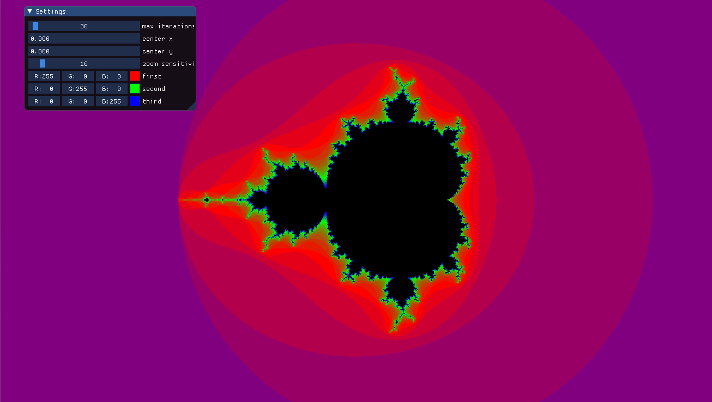

# Mandelbrot set

## Requirements

- 3.3 core profile
- prereqs - conan, cmake
- deps - glfw, glew, imgui, glm
- run.cmd/run.sh

## How to execute

1. ./build.sh

2. cd build

3. ./mandelbrot_run

## Examples

